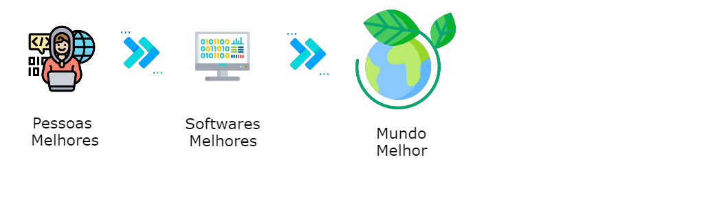

# Quem Somos

Uma consultoria que desenvolve pessoas enquanto desenvolve software.

## Porque existimos

> _Pra aprender e compartilhar uma abordagem de engenharia de software mais humana e consciente_

## Nossos Valores 

* Desenvolva sua próxima Versão :octocat:
* Ame seu dia :heart_eyes:
* Aprenda a valorizar cada pessoa :punch:
* Conecte-se com o impacto :electric_plug:

Caso queira conhecer um pouco mais sobre nós acesse [Jaya Tech](https://jaya.tech/)

# Nossas Vagas

| Técnologia                          | Posições |
|---|---|
| :coffee: Java / Kotlin              | 11 |
| :gem: Ruby                          | 3  |
| :iphone: Android / Kotlin           | 1  |
| :iphone: IOs                        | 1  |

# Como se aplicar 

Para se aplicar nas vagas que temos em aberto basta acessar o link abaixo e se candidatar. 

:point_right: [Aqui](https://bu8bvmptgrr.typeform.com/to/JTxGpg4U) :point_left:

